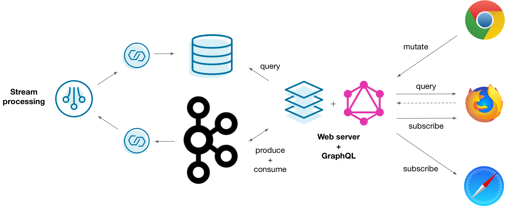
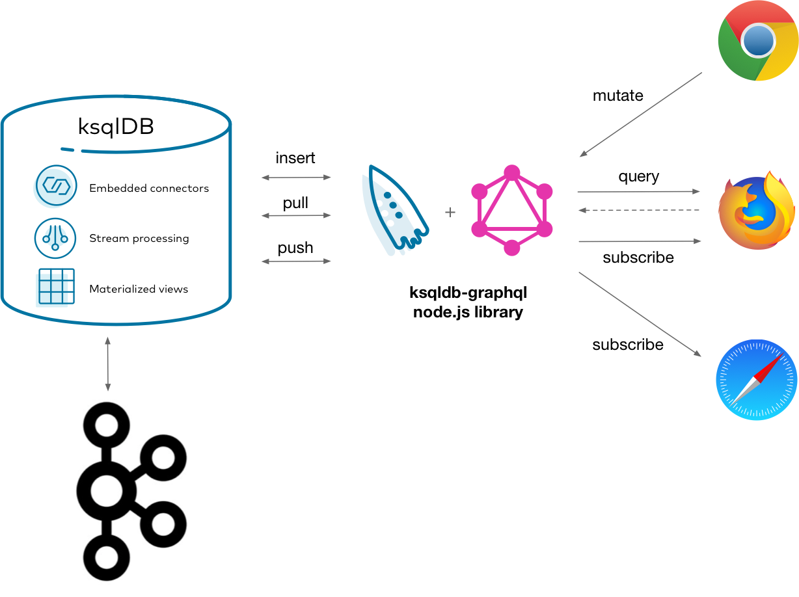

What is it?
-----------

An application backend is a software service that provides an API for a frontend application to interact with. When a frontend application displays information, it usually needs to communicate over a network to retrieve it. And when it lets users manipulate that information, it needs some way of persisting those changes.

There are a vast number of patterns for doing this with different technologies. But what they generally amount to is providing some way to write, read, and stream information between a frontend and backend.

{: class="centered-img" style="width: 90%"}

An increasingly popular way of doing this is by persisting all incoming events in Kafka and materializing them into views with a stream processor. The views are stored in a database. A web server issues interacts with both Kafka and the database to serve traffic and is ultimately fronted by GraphQL. This works, but it’s a lot to handle. Could you get the same solution with less complexity?

Why ksqlDB?
-----------

Connecting all of those systems in the right way is tricky. In addition to managing all the moving parts, it’s on you to make sure that data correctly flows from one component to the next. ksqlDB makes it easy to build an application backend by trimming down the number of components. It also provides a simple interface for writing, reading, and streaming events.

{: class="centered-img" style="width: 70%"}

Using ksqlDB and it’s out of the box GraphQL library, you can easily publish a powerful, modern API for your backend. It’s primitives for writing events, querying state, and subscribing to streams cleanly map onto the demands of today’s frontend applications.

Implement it
------------

Support that you work at an online auction company. ...

This tutorial ...

Next steps
----------

Want to learn more? Try another use case tutorial:

- [Materialized view/cache](materialized.md)
- [Streaming ETL pipeline](etl.md)
- [Event-driven microservice](event-driven-microservice.md)